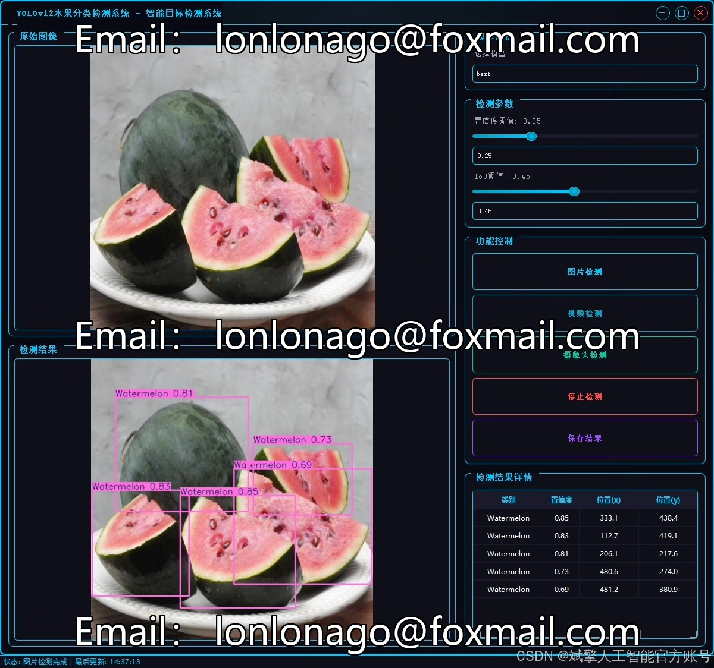
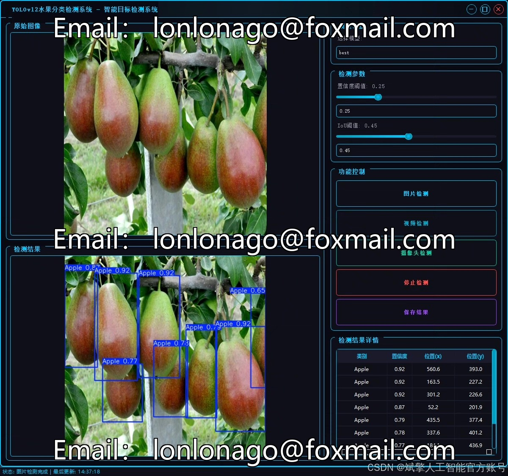
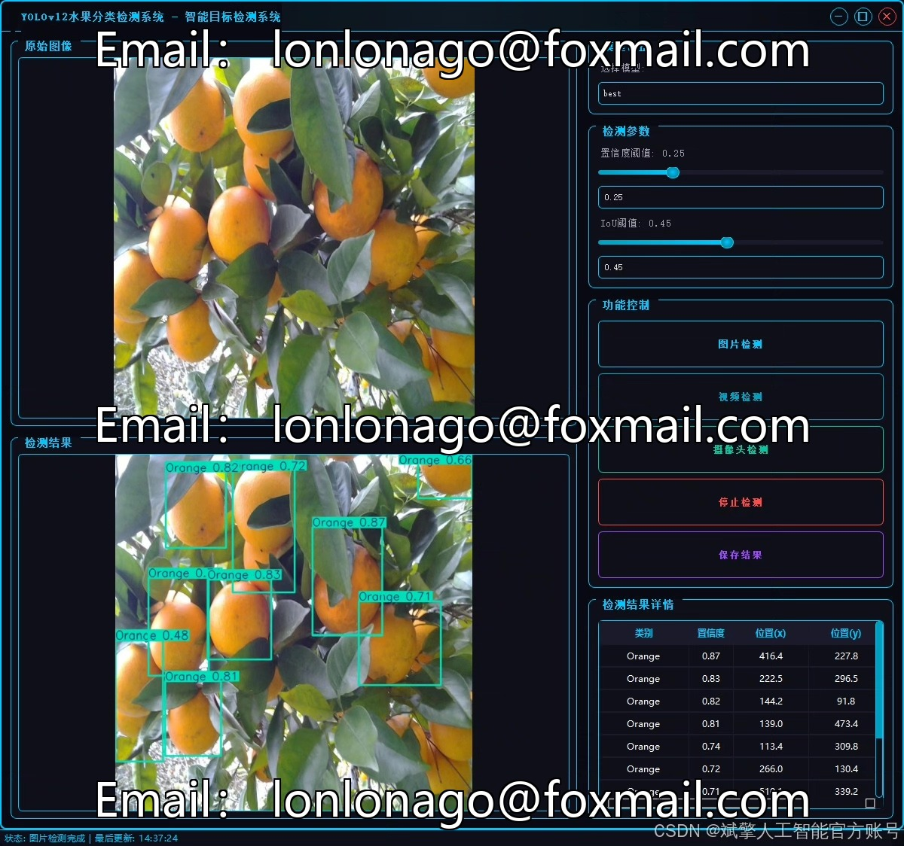
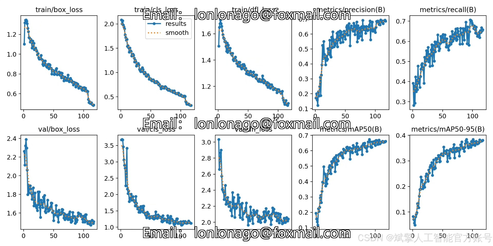
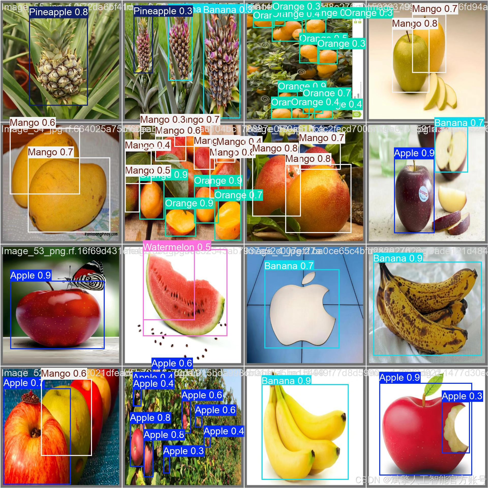

# YOLOv12 Fruit Recognition System

## Body

YOLOv12 Fruit Recognition System Based on Deep Learning YOLOv12: A Real-Time Fruit Recognition and Detection System (YOLOv12+YOLO dataset + UI interface + login/registration interface + Python project source code + model)

This paper designs and implements an efficient fruit recognition and detection system based on the YOLOv12 deep learning framework. It supports real-time detection of six common fruits: Apple, Banana, Mango, Orange, Pineapple, and Watermelon. The system uses a self-built YOLO dataset containing 768 training images, 129 validation images, and 110 test images for model training and evaluation. In conjunction with an intuitive UI interface and user login/registration features, it enhances the user experience.

✅ User Login/Registration: Supports password verification and security authentication.
✅ Three Detection Modes: Based on the YOLOv12 model, supports image, video, and real-time camera detection, accurately recognizing targets.
✅ Dual-Screen Comparison: Displays the original image and detection results on the same screen.
✅ Data Visualization: Real-time table displays the category, confidence, and coordinates of detected targets.
✅ Intelligent Parameter Tuning: Offers a confidence slide bar to dynamically optimize detection accuracy, adapting to different scene requirements.
✅ Sci-Fi Interactive Interface: Dark theme paired with dynamic light effects, reducing visual fatigue and enhancing operational experience.

## Images

## Payment

Here is a pay link on Stripe ( https://buy.stripe.com/3cs8yP7sY87d0vu9AB ). Please contact me lonlonago@foxmail.com after funding $89, and I will send you a complete data files , thank you!

